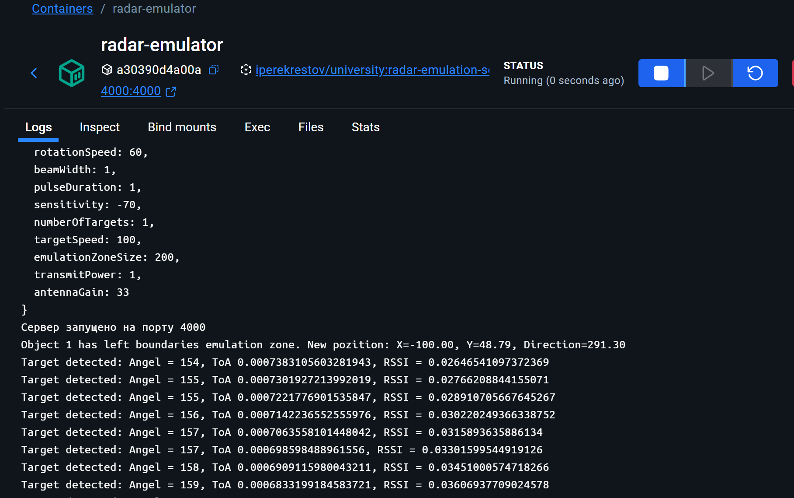
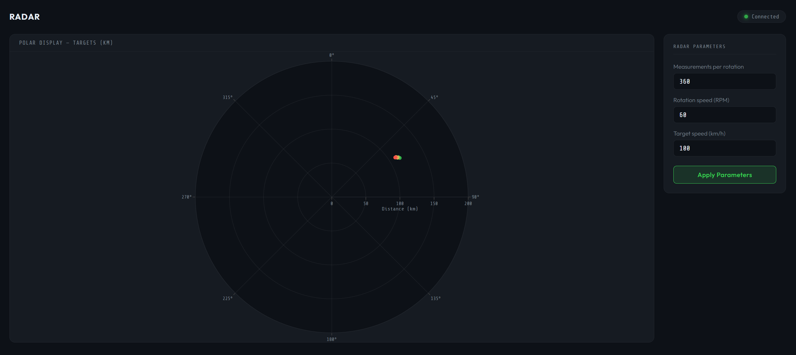
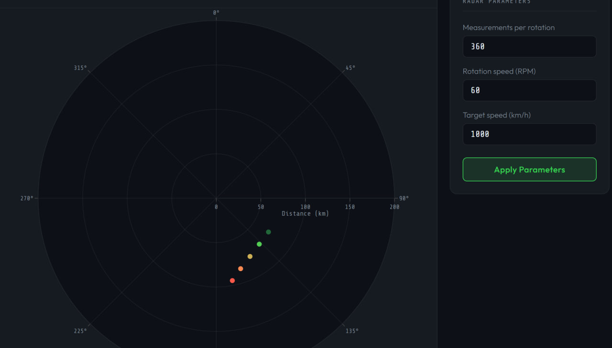

Лабораторна робота — Розробка додатку для візуалізації вимірювань радару
Бучко Вікторія ІПЗ-4.02
---

## Тема: Розробка додатку для візуалізації вимірювань радару

## Мета
- Розробити веб-додаток, який підключається до WebSocket сервера та зчитує дані про задетектовані цілі з емульованого радару
- Відобразити отримані дані на графіку в полярних координатах за допомогою бібліотеки Plotly
- Реалізувати обробку даних про відстань та потужність сигналу для кожної цілі
- Забезпечити можливість зміни параметрів радару через API запити

## Вимоги до середовища
- Встановлений Docker
- Браузер (Chrome / Firefox / Edge)
- Будь-який редактор коду (VS Code тощо)

## Інструкції для запуску проекту

1. Завантажити Docker image емулятора радару:
```bash
docker pull iperekrestov/university:radar-emulation-service
```

2. Запустити контейнер:
```bash
docker run --name radar-emulator -p 4000:4000 iperekrestov/university:radar-emulation-service
```

3. Відкрити файл `radar.html` у браузері — додаток автоматично підключиться до WebSocket сервера на `ws://localhost:4000` та почне отримувати дані

---

## 0. Підключення контейнера

Перед початком роботи необхідно завантажити та запустити Docker image емулятора радару. Контейнер надає WebSocket сервер на порту 4000, який генерує дані про зафіксовані цілі у реальному часі.


Рисунок 1 — Запущений Docker контейнер з емулятором радару

---

## 1. Розробка додатку для відображення цілей

Створено веб-додаток у вигляді HTML файлу, який підключається до WebSocket сервера та зчитує дані про зафіксовані цілі. Для побудови графіку використано бібліотеку Plotly.js, яка забезпечує відображення даних у полярних координатах


Рисунок 2 — Веб-додаток радару із підключенням до WebSocket

---

## 2. Обробка та візуалізація даних

### 2.1 Обробка WebSocket даних

Додаток отримує через WebSocket пакети з полями scanAngle (кут сканування) та echoResponses (масив ехо-відповідей). Для кожної ехо-відповіді обчислюється відстань за формулою:

```
d = (c × t) / 2
```

де `c = 299 792 458 м/с` — швидкість світла, `t` — час затримки сигналу. Реалізація обробки даних у функції onData:

```javascript
function onData(msg) {
    var now = Date.now();
    targets = targets.filter(function(t) { return now - t.ts < TTL; });

    if (msg.echoResponses && msg.echoResponses.length > 0) {
        msg.echoResponses.forEach(function(echo) {
            var distKm = (C * echo.time) / 2 / 1000;
            targets.push({ angle: msg.scanAngle, dist: distKm, power: echo.power, ts: now });
        });
    }

    Plotly.restyle('radarPlot', {
        r:              [targets.map(function(t) { return t.dist; })],
        theta:          [targets.map(function(t) { return t.angle; })],
        'marker.color': [targets.map(function(t) {
            var age = (Date.now() - t.ts) / TTL;
            return 1 - age;
        })]
    }, [0]);
}
```
Функція onData — обробка даних радару

### 2.2 Додавання можливості зміни параметрів через API

Реалізовано панель керування з можливістю зміни параметрів радару. Доступні параметри:
- Measurements per rotation — кількість вимірювань за оберт (1–720)
- Rotation speed (RPM) — швидкість обертання радару (1–120)
- Target speed (km/h) — швидкість цілей (0–1000)

Після зміни параметрів та натискання кнопки Apply Parameters графік оновлюється відповідно до нових значень


Рисунок 4 — Оновлення графіку після зміни параметрів радару

---

## 3. Налаштування графіка
Радіальна вісь графіку відображає відстань до цілі в кілометрах, діапазон - від 0 до 200 км
Колір кожної точки визначається її (віком) - свіжі точки мають яскравий червоний колір, а старіші поступово тьмяніють до темно-зеленого

---


```html
<!DOCTYPE html>
<html lang="uk">
<head>
    <meta charset="UTF-8">
    <meta name="viewport" content="width=device-width, initial-scale=1.0">
    <title>Radar Visualization</title>
    <script src="https://cdnjs.cloudflare.com/ajax/libs/plotly.js/2.26.0/plotly.min.js"></script>
    <link href="https://fonts.googleapis.com/css2?family=Share+Tech+Mono&family=Outfit:wght@300;500;700&display=swap" rel="stylesheet">
    <style>
        :root {
            --bg: #0d1117;
            --surface: #161b22;
            --border: #21262d;
            --accent: #39d353;
            --accent-dim: rgba(57, 211, 83, 0.12);
            --text: #e6edf3;
            --muted: #7d8590;
            --danger: #f85149;
        }

        * { margin: 0; padding: 0; box-sizing: border-box; }

        body {
            font-family: 'Outfit', sans-serif;
            background: var(--bg);
            color: var(--text);
            min-height: 100vh;
            padding: 28px;
        }

        header {
            display: flex;
            align-items: center;
            justify-content: space-between;
            margin-bottom: 24px;
        }

        .brand {
            display: flex;
            align-items: center;
            gap: 12px;
        }

        .brand-icon {
            width: 36px;
            height: 36px;
            border: 2px solid var(--accent);
            border-radius: 50%;
            display: flex;
            align-items: center;
            justify-content: center;
            position: relative;
        }

        .brand-icon::before {
            content: '';
            width: 6px;
            height: 6px;
            background: var(--accent);
            border-radius: 50%;
        }

        .brand-icon::after {
            content: '';
            position: absolute;
            width: 50%;
            height: 2px;
            background: var(--accent);
            right: 4px;
            top: 50%;
            transform-origin: left center;
            animation: sweep 2s linear infinite;
        }

        @keyframes sweep {
            from { transform: rotate(0deg); }
            to   { transform: rotate(360deg); }
        }

        .brand h1 {
            font-size: 1.1em;
            font-weight: 700;
            letter-spacing: 0.05em;
            text-transform: uppercase;
        }

        .brand span {
            font-family: 'Share Tech Mono', monospace;
            font-size: 0.7em;
            color: var(--muted);
        }

        .status-pill {
            display: flex;
            align-items: center;
            gap: 8px;
            padding: 6px 14px;
            background: var(--surface);
            border: 1px solid var(--border);
            border-radius: 20px;
            font-family: 'Share Tech Mono', monospace;
            font-size: 0.75em;
            color: var(--muted);
        }

        .status-dot {
            width: 8px;
            height: 8px;
            border-radius: 50%;
            background: var(--danger);
            transition: background 0.3s;
        }

        .status-dot.on {
            background: var(--accent);
            box-shadow: 0 0 8px var(--accent);
            animation: blink 2s ease-in-out infinite;
        }

        @keyframes blink {
            0%, 100% { opacity: 1; }
            50% { opacity: 0.4; }
        }

        .layout {
            display: grid;
            grid-template-columns: 1fr 260px;
            gap: 20px;
            align-items: start;
        }

        .plot-card {
            background: var(--surface);
            border: 1px solid var(--border);
            border-radius: 12px;
            overflow: hidden;
        }

        .plot-card-header {
            padding: 12px 20px;
            border-bottom: 1px solid var(--border);
            font-family: 'Share Tech Mono', monospace;
            font-size: 0.72em;
            color: var(--muted);
            letter-spacing: 0.08em;
            text-transform: uppercase;
        }

        #radarPlot { width: 100%; height: 620px; }

        .panel {
            display: flex;
            flex-direction: column;
            gap: 16px;
        }

        .card {
            background: var(--surface);
            border: 1px solid var(--border);
            border-radius: 12px;
            padding: 20px;
        }

        .card-title {
            font-family: 'Share Tech Mono', monospace;
            font-size: 0.68em;
            color: var(--muted);
            letter-spacing: 0.1em;
            text-transform: uppercase;
            margin-bottom: 18px;
            padding-bottom: 10px;
            border-bottom: 1px solid var(--border);
        }

        .field { margin-bottom: 14px; }

        .field:last-of-type { margin-bottom: 20px; }

        .field label {
            display: block;
            font-size: 0.78em;
            color: var(--muted);
            margin-bottom: 6px;
            font-weight: 300;
        }

        .field input {
            width: 100%;
            padding: 9px 12px;
            background: var(--bg);
            border: 1px solid var(--border);
            border-radius: 7px;
            color: var(--text);
            font-family: 'Share Tech Mono', monospace;
            font-size: 0.88em;
            outline: none;
            transition: border-color 0.2s;
        }

        .field input:focus {
            border-color: var(--accent);
        }

        .apply-btn {
            width: 100%;
            padding: 10px;
            background: var(--accent-dim);
            border: 1px solid var(--accent);
            border-radius: 7px;
            color: var(--accent);
            font-family: 'Outfit', sans-serif;
            font-size: 0.85em;
            font-weight: 500;
            letter-spacing: 0.03em;
            cursor: pointer;
            transition: background 0.2s;
        }

        .apply-btn:hover {
            background: rgba(57, 211, 83, 0.22);
        }

        .apply-btn:active {
            background: rgba(57, 211, 83, 0.3);
        }

        @media (max-width: 820px) {
            .layout { grid-template-columns: 1fr; }
        }
    </style>
</head>
<body>

<header>
    <div class="brand">
        <div>
            <h1>Radar</h1>
        </div>
    </div>
    <div class="status-pill">
        <div class="status-dot" id="dot"></div>
        <span id="connLabel">Disconnected</span>
    </div>
</header>

<div class="layout">
    <div class="plot-card">
        <div class="plot-card-header">Polar Display — Targets (km)</div>
        <div id="radarPlot"></div>
    </div>

    <div class="panel">
        <div class="card">
            <div class="card-title">Radar Parameters</div>

            <div class="field">
                <label>Measurements per rotation</label>
                <input type="number" id="inMPR" value="360" min="1" max="720">
            </div>
            <div class="field">
                <label>Rotation speed (RPM)</label>
                <input type="number" id="inRPM" value="60" min="1" max="120">
            </div>
            <div class="field">
                <label>Target speed (km/h)</label>
                <input type="number" id="inSpeed" value="100" min="0" max="1000">
            </div>

            <button class="apply-btn" onclick="applyConfig()">Apply Parameters</button>
        </div>
    </div>
</div>

<script>
    const C   = 299792458;
    const TTL = 6000;
    let targets = [];
    let ws = null;

    const layout = {
        polar: {
            radialaxis: {
                visible: true,
                range: [0, 200],
                tickfont: { color: '#7d8590', size: 10, family: 'Share Tech Mono' },
                gridcolor: 'rgba(255,255,255,0.06)',
                linecolor: '#21262d',
                title: { text: 'Distance (km)', font: { color: '#7d8590', size: 11 } }
            },
            angularaxis: {
                direction: 'clockwise',
                rotation: 90,
                tickfont: { color: '#7d8590', size: 10, family: 'Share Tech Mono' },
                gridcolor: 'rgba(255,255,255,0.06)',
                linecolor: '#21262d'
            },
            bgcolor: '#0d1117'
        },
        paper_bgcolor: 'rgba(0,0,0,0)',
        plot_bgcolor:  'rgba(0,0,0,0)',
        showlegend: false,
        margin: { t: 20, b: 20, l: 20, r: 20 },
        font: { color: '#e6edf3', family: 'Share Tech Mono' }
    };

    const plotData = [{
        type: 'scatterpolar',
        r: [],
        theta: [],
        mode: 'markers',
        marker: {
            size: 8,
            color: [],
            colorscale: [
                [0,   '#1a4731'],
                [0.4, '#39d353'],
                [0.7, '#ffa657'],
                [1,   '#f85149']
            ],
            cmin: 0,
            cmax: 1,
            showscale: false
        }
    }];

    Plotly.newPlot('radarPlot', plotData, layout, { responsive: true, displayModeBar: false });

    function setConn(on, text) {
        document.getElementById('dot').className = 'status-dot' + (on ? ' on' : '');
        document.getElementById('connLabel').textContent = text;
    }

    function onData(msg) {
        var now = Date.now();
        targets = targets.filter(function(t) { return now - t.ts < TTL; });

        if (msg.echoResponses && msg.echoResponses.length > 0) {
            msg.echoResponses.forEach(function(echo) {
                var distKm = (C * echo.time) / 2 / 1000;
                targets.push({ angle: msg.scanAngle, dist: distKm, power: echo.power, ts: now });
            });
        }

        Plotly.restyle('radarPlot', {
            r:              [targets.map(function(t) { return t.dist; })],
            theta:          [targets.map(function(t) { return t.angle; })],
            'marker.color': [targets.map(function(t) {
                var age = (Date.now() - t.ts) / TTL;
                // нова точка = 1 (червоний), стара = 0 (темно-зелений)
                return 1 - age;
            })]
        }, [0]);
    }

    function connect() {
        try {
            ws = new WebSocket('ws://localhost:4000');
            ws.onopen  = function() { setConn(true,  'Connected'); };
            ws.onclose = function() { setConn(false, 'Reconnecting...'); setTimeout(connect, 3000); };
            ws.onerror = function() { setConn(false, 'Error'); };
            ws.onmessage = function(evt) {
                try { onData(JSON.parse(evt.data)); } catch(e) {}
            };
        } catch(e) {
            setTimeout(connect, 3000);
        }
    }

    function applyConfig() {
        var cfg = {
            measurementsPerRotation: parseInt(document.getElementById('inMPR').value),
            rotationSpeed:           parseInt(document.getElementById('inRPM').value),
            targetSpeed:             parseInt(document.getElementById('inSpeed').value)
        };
        fetch('http://localhost:4000/config', {
            method: 'PUT',
            headers: { 'Content-Type': 'application/json' },
            body: JSON.stringify(cfg)
        }).catch(function() {});
    }

    connect();
</script>
</body>
</html>
```
